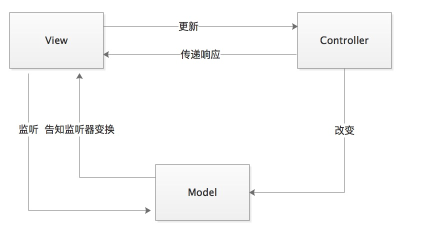
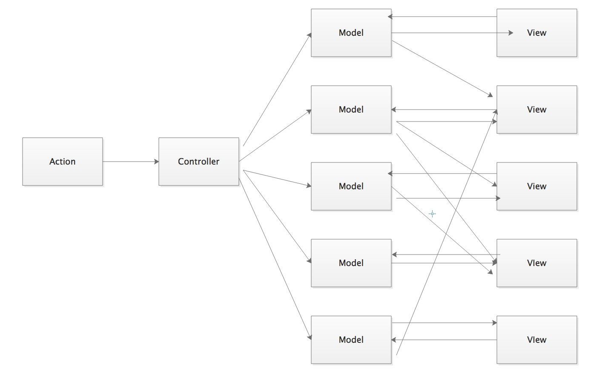
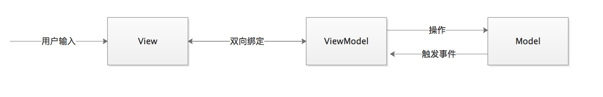
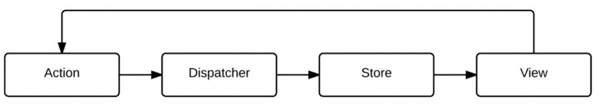
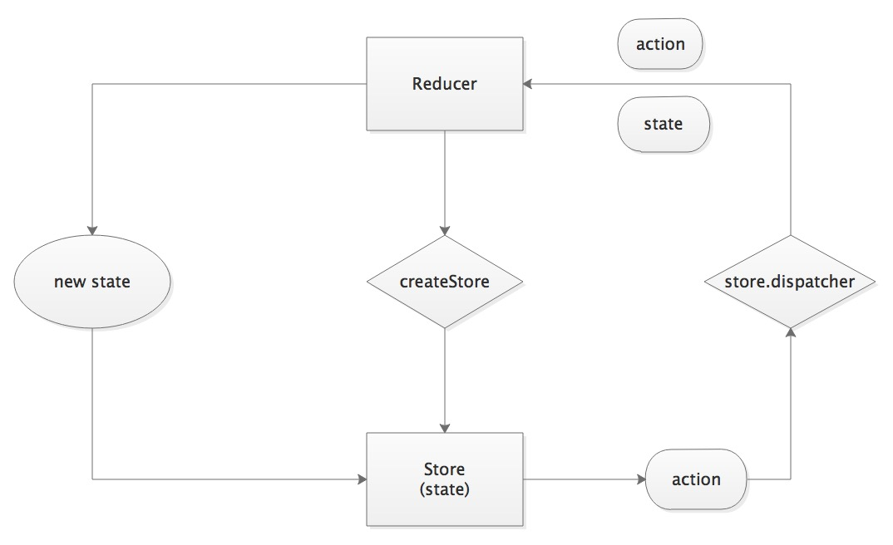
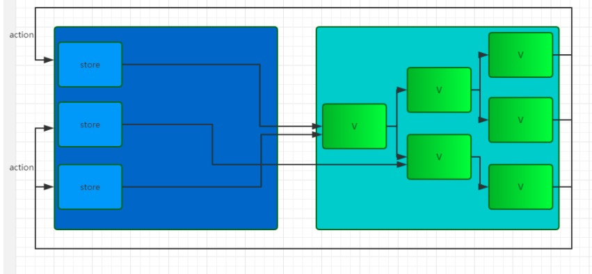

# Flux架构模式
在说flux模式之前，我们先说说mvc和mvvm模式

## MVC模式
> 通过关注数据界面分离，来鼓励改进应用程序结构。也就是MVC将业务数据(model)与用户界面(view)隔离，用控制器(controller)管理逻辑和用户输入。

### MVC模式中的三种角色

* **Model**

    > Model负责保存应用数组，和后端交互同步应用数据，或校验数据。Model主要与业务数据相关，与应用内交互状态无关
* **View**

    > View是Model的可视化，表示当前状态的视图。前端View负责构建和维护DOM元素。更新Model的实际任务是在Controller上。用户可以与View交互，包括读取和编辑Model，在Model中获取或设置属性值。*一个view通常对应一个model，所以在世实际开发过程中，会面临多个view对应多个model的状况*
* **Controller**

    > Controller负责连接view和model，model的任何变化会应用到view中，view的操作会痛殴controller应用到model中。
    
## MVC的问题
MVC模式看上去没有什么问题，但是它存在一个十分麻烦的缺点，这个缺点随着你的项目越来越大，逻辑复杂的时候非常的明显，就是混乱的数据流动方式。

    
### MVVM模式
MVVM的模式与MVC模式的最大区别在于**数据绑定**，也就是说view的数据状态的改变直接影响VM，反之依然。

### MVC模式带来问题的解决方案

如果渲染函数只有一个，统一放在Controller中，每次更新渲染页面，这样的话，任何数据的更新都只用调用重渲染就行，并且数据和当前页面的状态是唯一确定的。但是重渲染会带来严重的性能问题于用户体验问题。

而Flux也是解决这类问题的一种方案

## Flux模式

Flux的核心思想就是**数据和逻辑永远单向流动**

众所周知，React提倡的是一种单向数据流，指的是父子组件之间的单向数据流。而Flux中的单向数据流则是在整体架构上的延伸。在Flux应用中，数据从action到dispatcher，再到store,最终到view的路线是单向不可逆的，各个角色之间不会像MVC模式中那样存在交错的连线

因为要实现单向数据流，所以在Flux模式中的dispatcher中定义了严格的规则来限定我们对数据的修改操作。只能通过dispatcher来修改store中的state，所以同时，store中不能不暴露setter，强化数据修改的纯洁性。

上面谈到的如果渲染函数只有一个后，即每次数据的更新都会调用重渲染，会十分的影响性能。在React中，通过Virtual DOM这个技术来进行优化性能，因为每次重渲染的是内存上的Virtual DOM，并由于PureRender保障从重渲染到局部渲染的转换。

一个Flux应用由三大部分组成`dispatcher`,`store`和`view`

* **dispatcher**负责分发事件
* **store**负责保存数据，同时响应事件并更新数据
* **view**负责订阅store中的数据，并使用这些数据渲染相应的页面

### Flux的不足 
虽然Flux的中心化控制十分优雅。但是它最大的问题就是Flux的冗余代码太多。虽然Flux源码中几乎只有dispatcher的实现，但是在每个应用中东需要手动创建一个dispatcher的实例，而且在一个应用中含有多个store。

##基于Flux思想的Redux
Redux是基于Flux架构思想的一个库的实现，它主要的核心运作流程为：

### Redux与Flux的区别
* Redux中只有一个store，而Flux中有多个store来存储应用数据，并在store里面执行更新逻辑，当store变化的时候再通知controller-view更新自己的数据，Redux是将各个store整合成一个完整的store,并且可以根据这个store来得到完整的state，而且更新的逻辑也不再store中，而是在reducer中。
* Redux没有Dispatcher这个概念。它使用的是reducer来进行事件的处理，reducer是一个纯函数`(preState, action) => newState`,在Redux应用中，可能有多个reducer，每一reducer来负责维护应用整体state树中某一部分，多个reducer通过`combineReducers`方法合成一个根reducer,来维护整个state

 **如图的比较**
 Flux：
 

 Redux:

### Redux设计和使用的三大原则
* **单一的数据源**

    > 在Redux的思想里，一个应用永远只有唯一的数据源，使用单一数据源的好处在于整个应用状态都保存在一个对象中，我们随时可以提取出整个应用的状态进行持久化,这样的设计也为SSR提供了可能

* **状态是只读的**

    > 状态是只读的这个和Flux的思想相同，但是Redux中还限制了store的setter从而限制修改应用状态的能力。在Redux中，我们不会用代码来定义一个store，而是通过reducer，通过当前触发的action来对当前应用的state进行迭代，这里没有直接改变应用的状态，而是返回了一个全新的状态。
* **状态修改均由纯函数完成**

    > 在Flux中，是通过dispatcher的dispatch来触发action，不仅产生了冗余代码，而且直接修改了store中的数据，无法保存每次数据变化前后的状态，在Redux中，通过纯函数reducer来确定状态的改变，因为reducer是纯函数，所以形同的输入，一定会得到相同的输出，这样的话，返回的是一个全新的state，可以跟踪每一次触发action而改变状态的结果成为了可能，也就是可以达到炫酷的time travel 调试方法。
    
    
   
   
 😄 That's all~~ ([github](https://github.com/wangning0/Autumn_Ning_Blog),欢迎star、follow)😄

