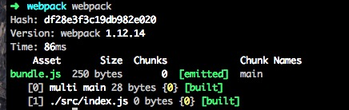
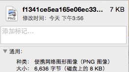

# webpack学习之路

当自己在学习webpack的时候，在网上发现中文的很详细的教程很少，于是便想将自己学习webpack的笔记记录整理下来，便有了这篇文章，希望对大家有所帮助，如果有错误，欢迎大家指出。

###在我们开始之前

* webpack有多种加载器(**Loader**,后面会介绍),可以处理各种需要被处理的静态文件
* webpack支持**CommonJs** **AMD** **CMD**规范
* 在使用webpack的项目中，默认配置文件为`webpack.config.js`, 模块文件，和Node写法一样，对外暴露接口,主要属性有:

	* plugins插件项
	* entry入口文件配置项
	* output对应输出项配置
	* module.loaders 最关键的配置，告知webpack不同的文件需要什么加载器进行处理
		    
* 模块系统的几种类型

	* `
		</body>
		</html>
		
再看`style.css`

	body{
		background:red;
	}

这个时候我们还没有写`webpack.config.js`,打开`index.html`,会看到

  打开控制台后，你会发现
  
  接下来，我们在`webpack.config.js`下加上如下代码
  
  	// webpack.config.js
	var path = require('path')
	var webpack = require('webpack');
	
	module.exports = {
	  entry: ['./src/index'],
	  output: {
	    path: path.join(__dirname, 'dist'),
	    filename: 'bundle.js'
	  },
	  plugins: [
	    new webpack.optimize.UglifyJsPlugin({
	      compressor: {
	        warnings: false,
	      },
	    })
	  ],
	  module: {
	    loaders: [{
	      test: /\.css$/,
	      loaders: ['style', 'css']
	    },
	    {
	        test: /\.(png|jpg)$/,
	        loaders: [
	            'file?hash=sha512&digest=hex&name=[hash].[ext]',
	            'image-webpack?bypassOnDebug&optimizationLevel=7&interlaced=false'
	        ]
	    }]
	  }
	}

  当然，在开始用webpack之前，要先安装相对应的模块，解析css文件 图片文件以及因为要对文件进行压缩，所以也要用到上文中所说的webpack自身内置的插件,所以也要导入webpack模块
  
  	$ npm install style-loader css-loader image-webpack-loader webpack --save-dev
  	
  安装好之后使用`webpack`命令后会有这样的提示

  但是这个时候你打开浏览器会发现，页面依旧没有什么效果，这是肯定的！我想大家肯定知道下一步该怎么做了，没错！在入口文件里面增加内容
  
  	require('./style.css');
	require('./demo.png');
	
再运行`webpack`,出现上图类似提示后，打开浏览器，你会发现变成了这个样子

并且在`dist`文件夹内，多出了两个文件，一个`f1341ce5ea165e06ec3358441b52d5ea.png`（随机产生的名字）如果你想获得这个名字，可以将`require('./demo.png')`输出查看，以及还有`bundle.js`,比较图片前后的大小，

可以发现，文件大小发生了改变。打开`bundle.js`你会发现该文件也被压缩了。是不是感觉很神奇？！
还有一个比较好玩的插件[htmlwebpackplugin](https://webpack.github.io/docs/list-of-plugins.html#htmlwebpackplugin)可以点击这里看看，把上面的例子改变下哦。

##最后

我相信看到这里你对`webpack`一定有了一定的认识，其实，还`webpack`还有很多强大的功能，比如，`webpack-dev-server`可以自动生成一个小型的`NodeJs Express`服务器从而实现webpack十分实用的功能热替换(HMR) 和其它的工具`gulp` `grunt`等一起使用。。。最后值得一提的是`react `和`webpack`是一对绝佳cp啊，有木有！！

**最后，希望这篇博客对大家有所帮助（如果是，请尽情star哦，😄），欢迎提出您的宝贵建议～**
