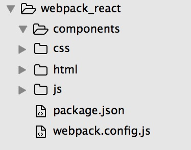
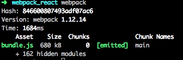
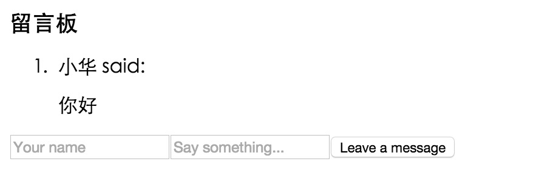
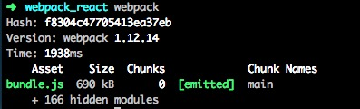
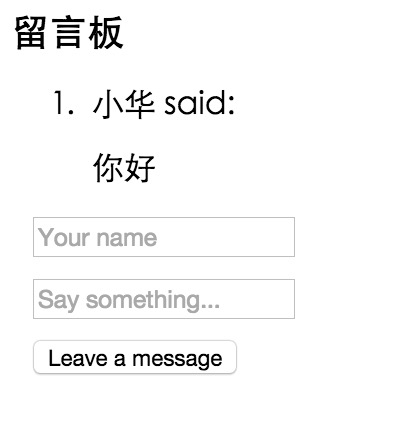
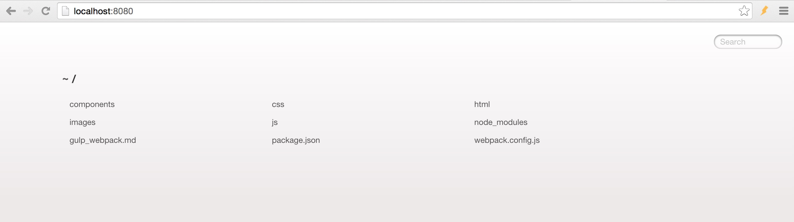

# webpack和react实战

在我原来的文章[webpack学习之旅](https://github.com/wangning0/Autumn_Ning_Blog/blob/master/blogs/3-12/webpack.md)中，我介绍了下关于`webpack`的用法，我想大家应该通过这篇文章大概知道`webpack`是怎么使用的了。那么这篇文章将为通过一个小的例子带领大家如何在项目中使用`webpack`。

## 开始之前

在开始之前，大家必须知道`webpack`的使用方法,以及`react`框架的使用方法,在下文中,不会花费较多的篇幅去进行讲解它们的细致的用法。没有接触过它们的同学，可以看这两篇文章[webpack学习之旅](https://github.com/wangning0/Autumn_Ning_Blog/blob/master/blogs/3-12/webpack.md)和[React_Learn](https://github.com/wangning0/Autumn_Ning_Blog/blob/master/blogs/3-16/react_learn.md),也可以参考[阮一峰老师的教程](http://www.ruanyifeng.com/blog/2015/03/react)。

## 开启实战之旅吧～

首先我先说下我们要做啥，我们这次要做一个简单版的留言板功能。需要用到的技术有 `webpack`和`react`。

* 第一步，创建一个这样的目录结构
	
	
	
	其中`components文件夹`放的是`react`的组件，其他文件夹顾名思义 我想大家肯定知道是用来干啥的了。
	
*  第二步,安装一些我们需要用到的包依赖，在该项目中我们要用到`jsx loader` 还有`css loader`还有`react`和`react-dom`,除了这些我们还要用到其他的依赖，下文会提到.

		npm install jsx-loader css-loader style-loader --save-dev
		npm install react react-dom --save
		
* 第三步，分析留言板的组成

	我们都知道`react`最重要的是思想是组件化,所以我们现在要做的是把一个留言板拆成一个个的组件。一个留言板,至少要分成两小块:1.评论显示区,2.评论区。将这两个小的组件组装起来称为一个大组件,一个留言板便做好了。那么接下来，我们来构建这些组件。

* 第四步，构成组件
	大家先在`components`文件里创建以下文件`messageBoard.js` `messageForm` `messageList`三个文件 ，分别代表 留言板，评论区，评论显示区。
	
	* 评论显示区组件代码
	
			//	messageList.js
				var React = require('react');

				var MessageList = React.createClass({
					render: function() {
						var messages = this.props.data.map(function(message, index) {
							return (
								<li key={index}>
									{message.name} said:
										
{message.message}

								</li>
							)
						});
				
						return (
							

								<ol id="messageList">
									{messages}
								</ol>
							

						)
					}
				
				})
				
				module.exports = MessageList;

	* 评论区组件代码
	
			//messageForm.js
			var React = require('react');
			
			var MessageForm = React.createClass({
				getInitialState: function() {
					return {
						name: '',
						message: ''
					};
				},
				handleNameChange: function(e) {
					this.setState({
						name: e.target.value
					})
				},
				handleMessageChange: function(e) {
					this.setState({
						message: e.target.value
					})
				},
				handleSubmit: function(e) {
					e.preventDefault();
					var name = this.state.name.trim();
					var message = this.state.message.trim();
					if (!name || !message) {
						return;
					}
					this.props.onMessageSubmit({
						name: name,
						message: message
					});
					this.setState({
						name: '',
						message: ''
					});
				},
				componentDidMount: function() {
			
				},
				render: function() {
					return (
						

			                    <form className="messageForm"
			                          onSubmit={this.handleSubmit}>
			                        <input
			                        type="text"
			                        placeholder="Your name"
			                        value={this.state.name}
			                        onChange={this.handleNameChange}
			                        id="textName"
			                        className="form-control"/>
			                        <input
				                        type="text"
				                        placeholder="Say something..."
				                        value={this.state.message}
				                        onChange={this.handleMessageChange}
				                        id="textMessage"
				                        className="form-control"/>
			                        <input
				                        type="submit"
				                        className="btn btn-default"
				                        value="Leave a message"/>
			                    </form>
			                

					)
				}
			});
			
			
			module.exports = MessageForm;			
	

	* 留言板组件
		
		因为留言板组件就是由上面的两个小组件所构成的，因为我们没有搭建服务器路由系统,所以我在代码中伪造了些`ajax`数据请求,在代码中会通过注释解释
		
			var React = require('react');
			var MessageList = require('../components/messageList.js');
			var MessageForm = require('../components/messageForm.js');
			
			var data = [{
				name: '小华',
				message: '你好'
			}]; //模拟在数据库中的留言
			
			var MessageBoard = React.createClass({
				getInitialState: function() {
					return {
						data: []
				};
			},
			componentDidMount: function() {
				//模范一个ajax请求数据回客户端的过程,在真实的应用场景中，此处放ajax请求
				setTimeout(function() {
					this.setState({
						data: data
					})
				}, 2000)
			},
			handleMessageSubmit: function(message) {
				//模拟将数据保存到数据库的请求
				data.push(message);
				//模拟重新从数据库拉取数据的过程,改变state的值
				this.setState({
					data: data
				});
			},
			render: function() {
				return (
					

							<h3>{this.props.title}</h3>
							<MessageList data={this.state.data} />
							<MessageForm onMessageSubmit={this.handleMessageSubmit}/>
						

				)
			}
			})
			
			module.exports = MessageBoard;	

* 第五步，写`webpack`的入口文件和`html`文件
	在`html`文件夹中创建一个`index.html`
	
			<!DOCTYPE html>
			<html lang="en">
			<head>
				<meta charset="UTF-8">
				<title>webpack with react</title>
			</head>
			<body>
				

				<!-- webpack执行后的输出文件 -->
				
			</body>
			</html>
			
	在`js`文件夹中创建一个`entry.js`
	
			var React = require('react');
			var ReactDOM = require('react-dom');
			var MessageBoard = require('../components/MessageBoard.js');
			
			ReactDOM.render(<MessageBoard title="留言板"/>,
				document.getElementById('container')
			)
* 第六步, 写`webpack`配置文件

			//webpack.config.js
			var path = require('path');
	
			module.exports = {
				entry: './js/entry.js',
				output: {
					path: path.join(__dirname, 'js/dist'),
					filename: 'bundle.js'
				},
				module: {
					loaders: [{
						test: /\.js|jsx$/,
						loader: 'jsx?harmony'
					}]
				}
			}
			
*  第七步，运行`webpack`

	在终端输入`webpack`,会产生：
	
	
	
	这就意味着我们成功了，接下来，用浏览器打开`index.html`
	
	
	
	会是这样的效果，但是看到一排的`input`标签元素 是不是很难受？那接下来我们简单的调解下`css`样式吧。

* 第八步，编写`css`重新利用`webpack`打包

	在`css`文件夹下，创建一个`style.css`文件
		
		//style.css
		input{
			display: block;
			margin: 10px;
		}
	
	在`webpack.config.js`中增加`css`加载器
	
			//webpack.config.js
			...
			module: {
			loaders: [{
				test: /\.js|jsx$/,
				loader: 'jsx?harmony'
			}, {
				test: /\.css$/,
				loader: 'style-loader!css-loader'
			}]
		}
	在`entry.js`中增加
			
			require('../css/style.css');

	重新在终端中输入`webpack`
	
	
	
	浏览器打开`index.html`
	
	
	
	本来到这里的时候我们就已经结束了，但是大家有没有想过，当你每次改变了`css`或 `js`文件都要重新`webpack`，十分的麻烦，而`webpack`有个最强大的功能就是热替换，也就是实时更新页面,所以接下来我们就来试试这个功能吧！

* 第九步 实现热替换(HMR)功能

	为了实现热替换功能，我们首先需要搭建一个服务器才行，在`webpack`里面有一个开发工具就是可以自动开启一个服务器，所以首先我们先安装依赖

		npm install webpack-dev-server --save-dev
		
	然后改变`webpack.config.js`
	
			//webpack.config.js
			...
			entry: [
			'webpack/hot/dev-server',
			'webpack-dev-server/client?http://localhost:8080/html',
			'./js/entry.js'
			]
			...	
	然后我们就可以开始使用`webpack`开启一个服务器了，为了开启这个服务，你必须在终端输入很长一段`shell` 
	
		webpack-dev-server --devtool eval --progress --colors --hot --content-base
	大概讲下它们代表的含义
	
	* webpack-dev-server - 在 localhost:8080 建立一个 Web 服务器
	* --devtool eval - 为你的代码创建源地址。当有任何报错的时候可以让你更加精确地定位到文件和行号
	* --progress - 显示合并代码进度
	* --colors - Yay，命令行中显示颜色！
	* --content-base  - 指向设置的输出目录,后面可以写你想指向的输出目录 不写默认为空目录
	
	为了偷懒，我们在`package.json`文件里面，增加一些内容
	
		"scripts": {
		    "build": "webpack",
		    "dev": "webpack-dev-server --devtool eval --progress --colors --hot --content-base"
		  }
		 
	还要安装`webpack`的包依赖和`react-hot 加载器`
	
		npm install webpack --save
		npm install react-hot-loader --save-dev
		
	再改变下`webpack.config.js`里面的设置
	
			//webpack.config.js
			module: {
			loaders: [{
				test: /\.js|jsx$/,
				loader: 'react-hot!jsx-loader?harmony'
			}, {
				test: /\.css$/,
				loader: 'style-loader!css-loader'
			}]
		}
	这样我们可以直接在终端输入`npm run dev` 然后效果和开始直接输入一大串`shell`一样
	
	接下来，我们直接在浏览器下访问`localhost:8080`
		
	
	
	再点击`html`就可以看到我们的页面了.

##最后

看到这里，我想大家应该知道`webpack`和`react`如何匹配使用了，当然这只是一个引子，希望这篇博文对大家有所帮助,写到这里不得不提的是`gulp`这个前端自动化工具十分的好用,而且`gulp-webpack`这个插件可以完美的运用在`gulp`管理的项目中～我用`gulp`实现了和这个项目一样的功能，没有教程但是大部分都是相似的，附上[链接](https://github.com/wangning0/react_gulp_action)!

附上[代码地址](https://github.com/wangning0/webpack_react)
**最后，希望这篇博客对大家有所帮助（如果是，请尽情star哦，😄），欢迎提出您的宝贵建议～**
